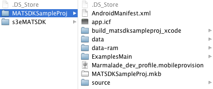
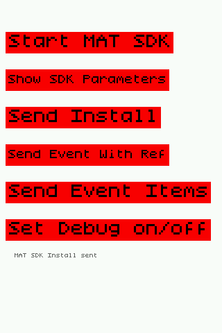

# MAT Marmalade Extension

Please see the Quick Start guide here:

[Marmalade Quick Start](https://developers.mobileapptracking.com/marmalade-plugin/)

### Change/Edit the Marmalade MAT Extension

While we do provide a complete build for the Marmalade MAT extension, you also have the ability to build the extension
from scratch on your own.  In this section, we provide the procedure required to do so. You may also use these
procedures to change and or edit the Marmalade MAT Extension.

This section assumes the following base folder: ios_android.

Note: Please make sure that [SCons](http://www.scons.org) is installed on your system. You can download SCons from [http://www.scons.org/download.php](http://www.scons.org/download.php).

Once downloaded, use Terminal to navigate to the SCons folder and then run:

    sudo python setup.py install

__Files:__

s3eMATSDK.s4e

- This is the definition file for all of the extension information such as structures, callbacks and methods

s3eMATSDK.mkf

- Make file to create the extension, defines what files to use and linker options for the extension. This is also where the MATSDK framework files are defined that need to be linked in.

s3eMATSDK_iphone/android.mkb

- Describes the resulting library that combines MATSDK static library with Marmalade methods to create a new static library.

s3eMATSDK_build.mkf

- Describes where the .o files from the MATSDK static library come from to combine to make the s3eMATSDK.a file.  This will be where the Android source gets linked in as well.

s3eMATSDK_android_java.mkb

- Auto-generate java make file.

__To Build the Extension for iOS__

The MobileAppTracking iOS static library must have its object files extracted and then combined and built into the .s4e Marmalade extension file.

1. Create or add/modify prototype methods in the .s4e file.

2. Extract the .o files from the MATSDK .a file, these files will be used when building the edk library.

    a. Create s3eMATSDK/incoming folder. This folder will be used as input when building the extension file.

    b. extract a slice from the MATSDK framework fat file (MobileAppTracker.a) into a new .a file from the /incoming folder:

        lipo MobileAppTracker.a -thin armv7 -output MobileAppTrackerArmv7.a

    c. extract the .o files from the MobileAppTrackerArmv7.a file:

        ar -x MobileAppTrackerArmv7.a

3. Rebuild the extension files. From the ios_android folder, run:

        /Applications/Marmalade.app/Contents/s3e/bin/edk-build s3eMATSDK/s3eMATSDK.s4e --platform=iphone

    that creates:

    - h/s3eMATSDK.h
    - interface/s3eMATSDK_interface.cpp
    - source/generic/s3eMATSDK_register.cpp

4. The following files should be edited manually since step 2 will not change them automatically:

    - source/generic/s3eMATSDK.cpp ← add new methods from the .s4e file header
    - source/h/s3eMATSDK_internal.h ← add new methods from the .s4e file header
    - source/iphone/s3eMATSDK_platform.mm ← this is the file that calls the native mobileapptracker static  library

5. Build the library files to be used in the test app.

        /Applications/Marmalade.app/Contents/s3e/bin/mkb s3eMATSDK/s3eMATSDK_iphone.mkb --arm

__To Build the Extension for Android__

1. Create or add/modify prototypes in the .s4e file.

2. Rebuild the extension files:

        /Applications/Marmalade.app/Contents/s3e/bin/edk-build s3eMATSDK/s3eMATSDK.s4e --platform=android

    that creates:
    
    - h/s3eMATSDK.h
    - interface/s3eMATSDK_interface.cpp
    - source/generic/s3eMATSDK_register.cpp

3. The following files should be edited manually since step 2 will not change them automatically:

    - source/generic/s3eMATSDK.cpp
    - source/h/s3eMATSDK_internal.h
    - source/android/s3eMATSDK_platform.cpp ← add new or changed methods here; these pass thru to the .java file.
    - source/android/s3eMATSDK.java ← this is the code that actually calls the mobileapptracker.jar file

4. Build the library files to be used in the test app.

    Set the NDK environment variable in terminal:
    
        export NDK_ROOT="/Developer/android-ndk-r8c"
    
    Run:

        /Applications/Marmalade.app/Contents/s3e/bin/mkb s3eMATSDK/s3eMATSDK_android.mkb --arm

5. Build the java .jar file.

        /Applications/Marmalade.app/Contents/s3e/bin/mkb s3eMATSDK/s3eMATSDK_android_java.mkb

### Test Application

In

    /ios_android/MATSDKSampleProj ← same project path for both Android and iOS

The project uses Marmalade's ExamplesMain to draw on the screen.  The test application will exercise all of the
major methods of the MobileAppTracker SDK.  It is set up to run on a demo account, but can be modified to point to any account.

__Test Application Project Folder:__

__iOS__

1. Testing with a static library for iOS cannot be run on the simulator, it won't load the MATSDK library.
2. The MATSDKSampleProj.cpp calls the _platform extension methods and combines the MAT sdk delegate callback.
3. Run the MATSDKSampleProj.mkb (double click) to create and open the sample project in xcode.
4. The xcode project provides a unit test to exercise the MAT SDK edk methods.

__Android__

1. Testing can occur on both device or emulator.
2. in /ios_android/s3eMATSDK/source/android.
3. s3eMATSDK.java - contains the code to directly call the mobileapptracker jar code.

__Build and Run the iPhone test app:__

1. Requires a device to run on.
2. Build the .ipa file in MATSDKSampleProj folder:

        /Applications/Marmalade.app/Contents/s3e/bin/mkb MATSDKSampleProj.mkb --deploy=iphone

3. Double click on the .ipa file to install via iTunes.

        ios_android/MATSDKSampleProj/build_matsdksampleproj_xcode/deployments/default/iphone/debug/MATSDKSampleProj.ipa

4. If the .ipa file will not build, it has to be signed with a valid developer provisioning profile.

__Build and Run the Android test app:__

1. Can run on simulator or device.
2. Build the .apk from MATSDKSampleProj:

        /Applications/Marmalade.app/Contents/s3e/bin/mkb MATSDKSampleProj.mkb --deploy=android

in

        /ios_android/MATSDKSampleProj/build_matsdksampleproj_xcode/deployments/default/android/debug/arm

__How to install the .apk on the device or simulator__ Note: Replace path with your android tools path.

    ~/Documents/android-sdk-macosx/platform-tools/adb kill-server
    ~/Documents/android-sdk-macosx/platform-tools/adb start-server
    ~/Documents/android-sdk-macosx/platform-tools/adb install -r MATSDKSampleProj.apk

### Sample Project Code

Here are a few code samples from the Marmalade extension and the Sample Project that tests the extension.

__.s4e File__
The Extension begins with a .s4e file that describes the methods and data structures that will be implemented by the extension. The methods are platform independent as by this example:

    void MATTrackInstallWithReferenceId(const char* refId) run_on_os_thread

The .s4e file is used by Marmalade to create the source files that will be used in creating platform code.

MobileAppTracker SDK methods implemented by Marmalade Extension. Please see the MobileAppTracker.h file for further information.
Also, note, not all of these methods are implemented in all platforms.

Here are the methods defined in the s3eMATSDK.s4e file:

    void MATStartMobileAppTracker(const char* adId, const char* convKey) run_on_os_thread

    // Tracking Methods
    void MATMeasureSession() run_on_os_thread
    void MATMeasureActionForEventIdOrName(const char* eventIdOrName, const char* refId) run_on_os_thread
    void MATMeasureActionForEventIdOrNameItems(const char* eventIdOrName, const MATArray* items, const char* refId, const char* revenueAmount, const char* currencyCode, uint8 transactionState, const char* receipt, const char* receiptSignature) run_on_os_thread
    void MATMeasureAction(const char* eventIdOrName, const char* revenue, const char* currency) run_on_os_thread
    void MATSetPluginName(const char* pluginName) run_on_os_thread

    // Setter Methods
    void MATSetPackageName(const char* packageName) run_on_os_thread
    void MATSetCurrencyCode(const char* currencyCode) run_on_os_thread
    void MATSetOpenUDID(const char* openUDID) run_on_os_thread
    void MATSetUIID(const char* uiid) run_on_os_thread
    void MATSetUserId(const char* userId) run_on_os_thread
    void MATSetFacebookUserId(const char* userFacebookId) run_on_os_thread
    void MATSetTwitterUserId(const char* userTwitterId) run_on_os_thread
    void MATSetGoogleUserId(const char* userGoogleId) run_on_os_thread
    void MATSetRevenue(const char* revenue) run_on_os_thread
    void MATSetSiteId(const char* siteId) run_on_os_thread
    void MATSetTRUSTeId(const char* tpid) run_on_os_thread
    void MATSetAppAdTracking(bool enable) run_on_os_thread
    void MATSetDelegate(bool enable) run_on_os_thread
    void MATSetUseHTTPS(bool enable) run_on_os_thread
    void MATSetJailbroken(bool isJailbroken) run_on_os_thread
    void MATSetShouldAutoDetectJailbroken(bool shouldAutoDetect) run_on_os_thread
    void MATSetMACAddress(const char* mac) run_on_os_thread
    void MATSetODIN1(const char* odin1) run_on_os_thread
    void MATSetUseCookieTracking(bool useCookieTracking) run_on_os_thread
    void MATSetAge(int age) run_on_os_thread
    void MATSetGender(int gender) run_on_os_thread
    void MATSetLocation(const char* latitude, const char* longitude, const char* altitude) run_on_os_thread

    // App-to-App Tracking
    void MATStartAppToAppTracking(const char* targetAppId, const char* advertiserId, const char* offerId, const char* publisherId, bool shouldRedirect) run_on_os_thread
    void MATSetRedirectUrl(const char* redirectUrl) run_on_os_thread

    // Apple Advertising Identifier and Vendor Identifier
    void MATSetAppleAdvertisingIdentifier(const char* advertiserId) run_on_os_thread
    void MATSetAppleVendorIdentifier(const char* vendorId) run_on_os_thread
    void MATSetShouldAutoGenerateAppleVendorIdentifier(bool shouldAutoGenerate) run_on_os_thread
    void MATSetShouldAutoGenerateAppleAdvertisingIdentifier(bool shouldAutoGenerate) run_on_os_thread

    // Debug Methods
    void MATSDKParameters() run_on_os_thread
    void MATSetDebugMode(bool shouldDebug) run_on_os_thread
    void MATSetAllowDuplicates(bool allowDuplicates) run_on_os_thread

__Sample Workflow__
Starting with the sample project, in the MATSDKSampleProj.cpp, there are a series of buttons that execute various methods.
For this example, we’ll follow the flow of the track install method (trackInstallWithReferenceId).

- Button press for Track Install button:

    Calls s3etrackInstallWithReferenceId("Marmalade Install Test") which calls a method in the s3eMATSDK → Source → Generic → s3eMATSDK.cpp.

- The generic cpp file passes the method to the appropriate platform file.

- The following code calls a method in either the android or the iPhone platform code:

        void s3etrackInstallWithReferenceId(const char* refId)
        {
            s3etrackInstallWithReferenceId_platform(refId);
        }

__for iPhone:__

- In s3eMATSDK_platform.mm,  this actually calls the MobileAppTracker static library in iOS:

        void s3etrackInstallWithReferenceId_platform(const char* refId)
        {
            NSLog(@"track install %@", [NSString stringWithUTF8String:refId]);
            [[MobileAppTracker sharedManager] trackInstallWithReferenceId:[NSString  stringWithUTF8String:refId]];
        }

__for Android:__

- The platform file s3eMATSDK_platform.cpp uses JNI to call the java methods called in the s3eMATSDK.java file.
- In the init method s3eResult MATSDKInit_platform(), using JNI, the install method is put into a method reference variable:

        g_MATTrackInstallWithReferenceId = env->GetMethodID(cls, "MATTrackInstallWithReferenceId", "(Ljava/lang/String;)V");

- Then the method variable is called via the following code:

        void MATTrackInstallWithReferenceId_platform(const char* refId)
        {
            JNIEnv* env = s3eEdkJNIGetEnv();
            jstring refId_jstr = env->NewStringUTF(refId);
            env->CallVoidMethod(g_Obj, g_MATTrackInstallWithReferenceId, refId_jstr);
            env->DeleteLocalRef(refId_jstr);
        }

- This is then passed through to the actual java code in s3eMATSDK.java, where the actual call to the MobileAppTracker.jar file occurs.

        public void MATTrackInstallWithReferenceId(String refId)
        {
            mat.setRefId(refId);
            mat.trackInstall();
        }

- Testing the Android or iOS app shows the following:

